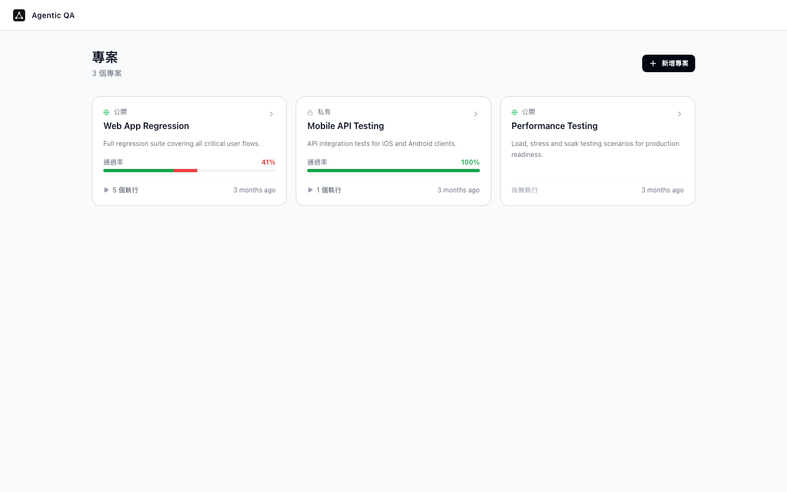
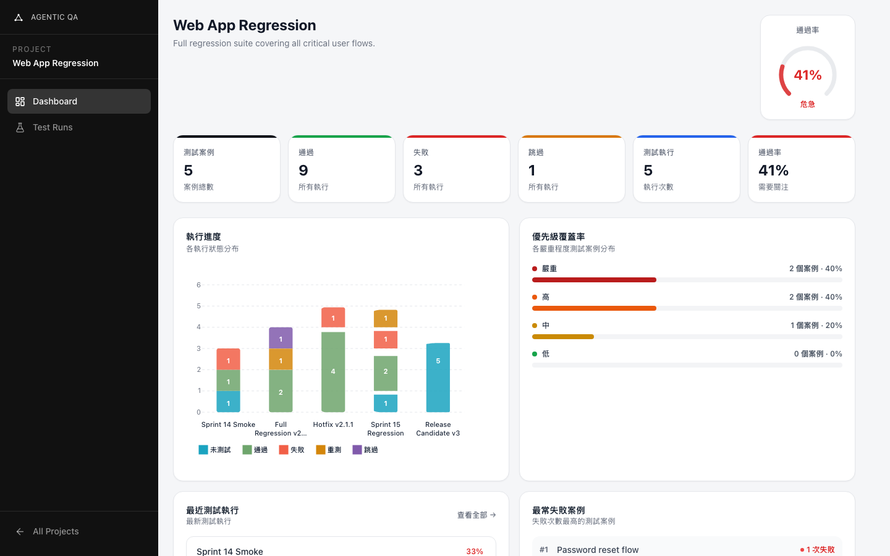
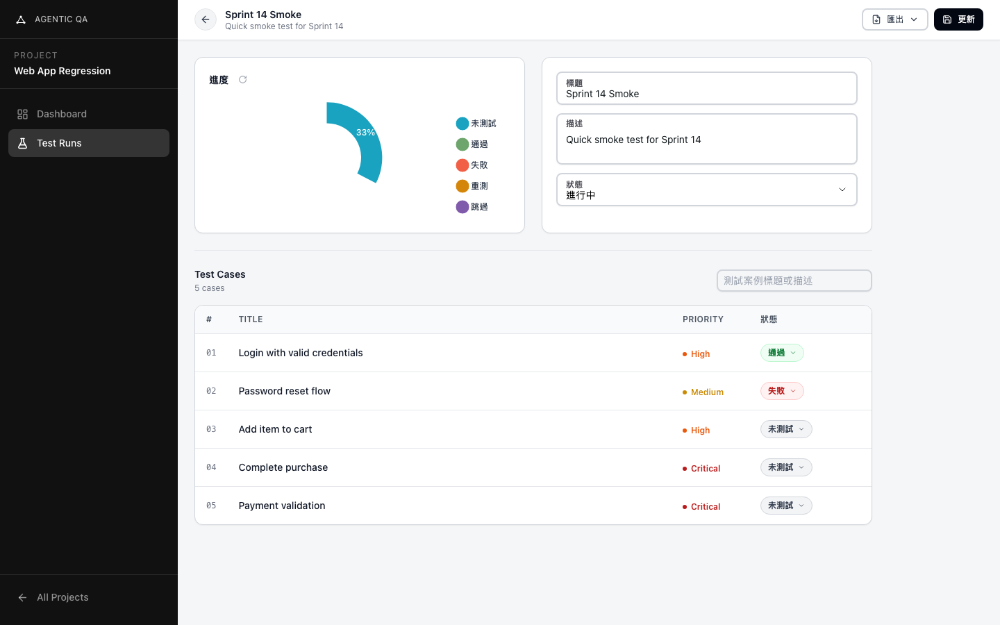
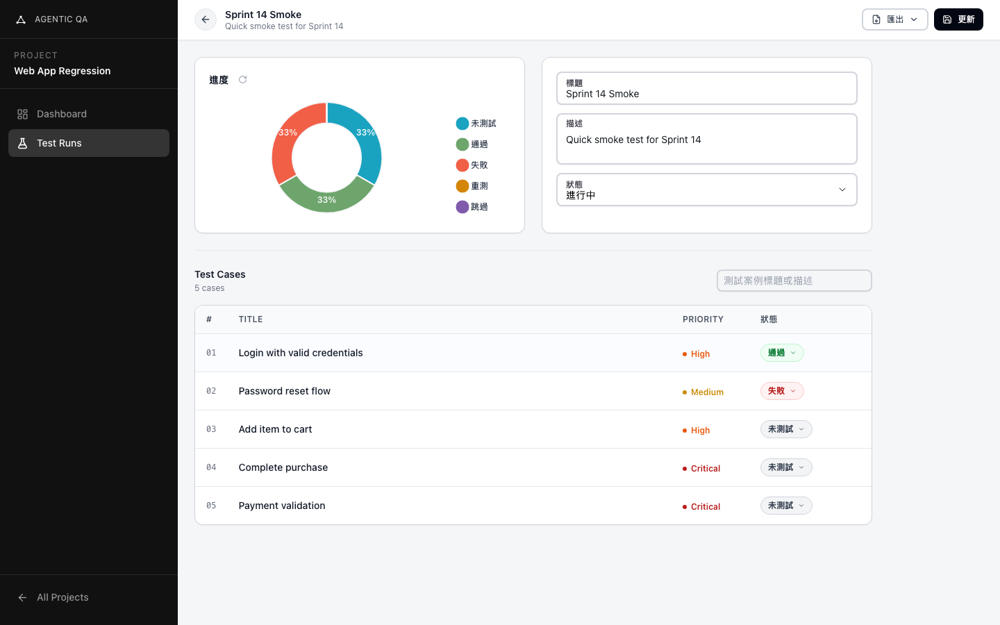

# Agentic QA — 測試管理平台

> 🌐 [English README](./README-en.md)

**Agentic QA** 是一套專為 QA 工程師與開發團隊設計的現代化測試案例管理平台。介面以生產力為優先，提供清晰的專案結構、測試執行追蹤與品質指標可視化，並從架構層面為未來的 AI 驅動後端預留擴充空間。

---

## 截圖

| 專案列表 | 專案儀表板 |
|---|---|
|  |  |

| 測試執行編輯器 | 測試案例詳情 |
|---|---|
|  |  |

---

## 專案簡介

大多數團隊的測試管理是零散的 — 試算表、Notion 文件，或是過於龐大而不符合敏捷節奏的工具。Agentic QA 的目標是成為輕量、可擴充的替代方案：快速建立、易於導覽，且能隨團隊規模成長。

目前版本為**純前端原型**，搭配真實情境的 Mock 資料。架構上已為後端整合預做設計 — 資料存取完全抽象在 hooks 層之後，未來從 Mock 切換至真實 API 只需替換 hooks，不需改動任何元件。

---

## 目前功能

### 專案管理
- 建立並管理多個專案，支援公開 / 私有可見性設定
- 每個專案的儀表板，含通過率圖表與測試執行摘要
- 失敗率最高的測試案例面板，方便快速分流問題

### 測試執行管理
- 在專案下建立測試執行（Test Run）
- 將測試案例指派給團隊成員
- 逐案追蹤狀態：**通過**、**失敗**、**重測**、**略過**、**未測試**
- 執行層級的甜甜圈進度圖與整體通過率

### 測試案例詳情（執行中）
- 完整案例檢視，含描述、步驟、前置條件與預期結果
- 即時新增、編輯、刪除評論
- 變更歷史紀錄
- 指派人選擇器（含搜尋）

### 多語言支援
- 完整介面支援**英文**與**繁體中文**
- 基於 next-intl App Router 整合，語言代碼包含於路徑中（`/en/...`、`/zh-TW/...`）

---

## 專案架構

```
agentic-qa-tcmp/
├── src/
│   ├── app/[locale]/               # App Router — 所有路由以 locale 為前綴
│   │   ├── layout.tsx              # 根佈局（HeroUI provider、i18n）
│   │   ├── page.tsx                # 重新導向至 /projects
│   │   ├── not-found.tsx           # 404 頁面
│   │   ├── loading.tsx             # 全域載入狀態
│   │   ├── error.tsx               # 全域錯誤邊界
│   │   └── projects/
│   │       ├── page.tsx            # Server shell — 建立 i18n messages
│   │       ├── ProjectsPage.tsx    # Client — 專案列表 + 建立 Modal
│   │       └── [projectId]/
│   │           ├── layout.tsx      # 側邊欄導覽
│   │           ├── home/           # 專案儀表板（圖表、統計）
│   │           ├── runs/           # 測試執行清單
│   │           │   ├── page.tsx
│   │           │   ├── RunsPage.tsx
│   │           │   └── [runId]/    # 執行編輯器（案例表 + 詳情面板）
│   │           │       ├── layout.tsx
│   │           │       ├── RunEditor.tsx
│   │           │       ├── RunCaseTable.tsx
│   │           │       ├── RunHeader.tsx
│   │           │       ├── RunInfoCard.tsx
│   │           │       └── cases/[caseId]/
│   │           │           ├── page.tsx
│   │           │           ├── DetailPane.tsx
│   │           │           └── CaseDetail.tsx
│   │           └── members/        # 專案成員清單
│   ├── data/
│   │   └── mockData.ts             # 種子資料 — 後端就緒後替換為 API 呼叫
│   └── i18n/
│       ├── routing.ts              # 支援語言 + 預設語言
│       └── request.ts              # next-intl 伺服器設定
├── hooks/                          # 資料存取層（抽象 Mock → 未來 API）
│   ├── useProject.ts
│   ├── useProjects.ts
│   ├── useRun.ts
│   ├── useRuns.ts
│   └── useCases.ts
├── types/                          # TypeScript 型別（對齊未來 API 回傳結構）
├── components/                     # 共用 UI 元件
│   ├── UserAvatar.tsx
│   ├── Comments.tsx
│   ├── History.tsx
│   ├── TestCasePriority.tsx
│   └── ProjectShell.tsx
├── utils/                          # 純工具函式
│   ├── rateColor.ts                # 通過率 → 顏色閾值
│   ├── formGuard.ts
│   └── errorHandler.ts
├── messages/                       # i18n 翻譯檔
│   ├── en.json
│   └── zh-TW.json
└── Dockerfile / docker-compose.yml # 可選：無需安裝 Node.js 的本地開發環境
```

### 架構原則

**Server / Client 分離** — 每個 `page.tsx` 都是 Server Component，只負責擷取路由參數、呼叫 `useTranslations`，並將型別化的 messages props 傳給同層的 Client Component。`useTranslations` 永遠不在客戶端執行。

**Hooks 層** — 元件不直接引用 `mockData.ts`。所有資料讀取都透過 `hooks/` 進行。後端到位後只需更換 hooks 實作，元件零改動。

**URL 驅動狀態** — 頁籤選擇與篩選條件存在 URL search params，而非 React state。頁面可加入書籤，符合 B2B 工具使用者的預期行為。

---

## 本地啟動

### 前置需求

- Node.js 18 以上
- npm

### 安裝與執行

```bash
git clone https://github.com/JulianWangHZ/Test-Management-Platform.git
cd Test-Management-Platform
npm install
npm run dev
```

開啟 [http://localhost:3000](http://localhost:3000)。

### Docker（無需安裝 Node.js）

```bash
docker-compose up
```

開啟 [http://localhost:3000](http://localhost:3000)。

---

## 功能藍圖

平台設計為分階段擴充，以下是規劃方向，優先順序將依團隊需求調整。

### Phase 1 — 後端整合

前端已針對未來 REST API 預先塑形，替換 Mock 層是第一個里程碑。

- 外部後端服務（REST API）
- JWT 認證 — 登入 / 註冊 / SSO
- PostgreSQL 資料庫與 Migration
- 角色權限控制（管理員、Manager、Developer、Reporter）
- WebSocket 即時同步執行狀態

### Phase 2 — 進階測試管理

- **測試案例匯入 / 匯出** — Excel（xlsx）、CSV、Jira
- **CI/CD 整合** — 透過 Webhook 從 GitHub Actions、Jenkins 等 Pipeline 推送執行結果
- **批次操作** — 跨資料夾複製、移動、標記測試案例
- **資料夾與標籤管理** — 階層式案例組織架構與自訂標籤
- **不穩定測試偵測** — 標記在多次執行中結果不一致的案例

### Phase 3 — 裝置與環境監控

- **裝置矩陣** — 追蹤各瀏覽器、作業系統、螢幕尺寸與裝置類型的測試結果
- **環境管理** — 為每次執行定義測試環境（Staging、QA、Production）
- **相容性視圖** — 視覺化呈現裝置矩陣的通過 / 失敗覆蓋率
- **截圖與影片附件** — 為失敗案例附上佐證資料

